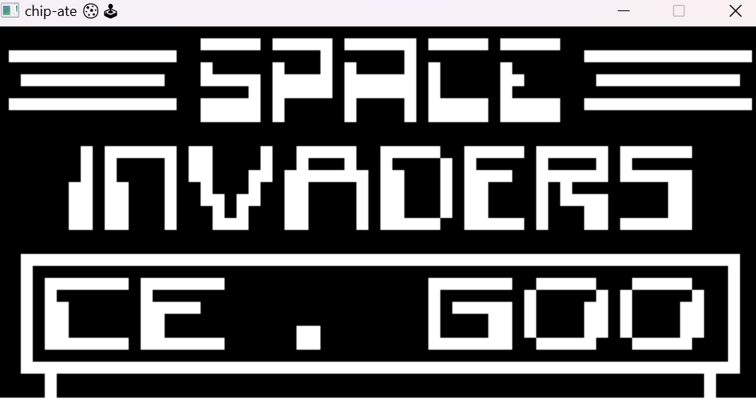

# 🕹 CHIP-ATE
Interpreter / emulator for the CHIP-8 able to run all the classic 1970s CHIP-8 games (provided you have the rom 😁)

# RUNNING IT
You can build using the Makefile by running `make (path to ROM file)` (only tested on Windows). An `.exe` file is built and stored in `/bin`. 

# RESOURCES USED
- https://tobiasvl.github.io/blog/write-a-chip-8-emulator/
- http://devernay.free.fr/hacks/chip8/C8TECH10.HTM#memmap
